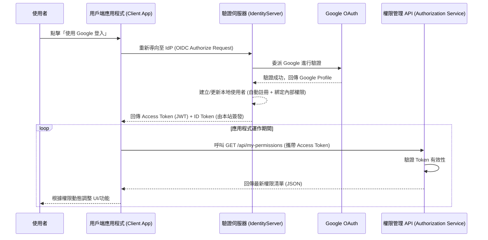

# 企業級身分驗證與權限控管系統架構規劃書

**日期**: 2025-12-21
**版本**: v1.1
**作者**: Google 驗證與權限控管系統架構師 (AI Agent)

---

## 1. 專案背景與目標

本專案旨在基於 **Duende IdentityServer** 建構一套高安全性、可擴充的中央身分驗證系統 (Centralized Identity Provider, IdP)。
目前的短期目標是整合 **Google OAuth**，實現「使用者登入 -> 取得 JWT -> 透過 Token 實時查詢權限」的流程。
長期目標則是支援 **多組織 (Multi-Tenant)** 與 **多應用程式 (Multi-App)** 的權限治理，確保企業內部的數位資產存取安全。

## 2. 核心功能定位：完全自主的驗證中心 (Self-Hosted Identity Provider)

本系統不僅僅是 Google 登入的「代理 (Proxy)」，而是一個 **完全獨立且功能完整的 OpenID Connect Provider (OP)**。
這意味著我們擁有對身分驗證流程的 **絕對控制權**。

### 2.1 什麼是「自主驗證中心」？
*   **Token 發行者 (Token Issuer)**：
    *   即使使用者透過 Google 登入，最終應用程式拿到的 JWT **是由本系統簽發的** (Issuer: `https://your-identity-server/`)，而非 Google。
    *   這讓我們能自由將內部的權限資料 (Roles, Permissions) 寫入 Token，而不受 Google 限制。
*   **統一 Session 管理**：
    *   支援 Single Sign-On (SSO)。使用者只需登入一次，即可存取所有串接此系統的應用程式 (PosApp, HR System, CRM...)。
*   **集中式登出 (Single Sign-Out)**：
    *   使用者登出時，系統可通知所有已登入的應用程式同步登出，確保安全。

---

## 3. 核心流程解決方案 (Solution Architecture)

針對您提出的「Google OAuth 登入 + JWT + API 權限查詢」需求，我們採用 **現代化 OIDC 混合授權模式** 搭配 **即時權限查詢服務 (Permission API)**。

### 3.1 系統流程圖

---

## 4. 系統細部功能詳解 (Detailed System Capabilities)

本系統具備極高細粒度的配置能力，以下是已具備的核心控制功能：

### 4.1 用戶端與導向控制 (Client & Redirect Control)
我們可以針對每一個接入的應用程式 (Client) 進行獨立設定：
*   **Redirect URIs (重新導向網址)**：
    *   嚴格的白名單機制。只有在清單中的網址 (e.g., `https://pos-app.com/callback`) 才能接收 Token，防止 Token 劫持攻擊。
    *   支援多個 Redirect URI (例如：同時支援 `localhost` 開發環境與正式環境)。
*   **Post-Logout Redirect URIs**：
    *   指定使用者登出後，應被導向回哪個頁面。
*   **Allowed CORS Origins**：
    *   設定允許哪些網域透過 JavaScript (AJAX) 跨域存取驗證伺服器。

### 4.2 Token 生命週期管理 (Token Lifetime Management)
我們可以根據安全需求，自訂各種 Token 的存活時間：
*   **Identity Token (身分憑證)**：預設 5 分鐘。用於應用程式確認使用者身分。
*   **Access Token (存取憑證)**：
    *   **可設定效期**：例如預設 1 小時 (3600秒)。這是一把「鑰匙」，用來呼叫 API。
    *   **短效期策略**：若需要更高安全性，可將 Access Token 設為 10 分鐘，強迫 App 頻繁更新，以利即時阻斷非法存取。
*   **Refresh Token (更新憑證)**：
    *   **Absolute Lifetime (絕對效期)**：例如 30 天。超過此時間必須重新登入。
    *   **Sliding Lifetime (滑動效期)**：例如 15 天。若使用者持續活躍，Token 效期會自動展延。
    *   **可設定是否啟用**：針對高安全性 App (如網銀)，可選擇不啟用 Refresh Token，強迫每次開啟 App 都要重新驗證。

### 4.3 授權模式支援 (Grant Types)
*   **Authorization Code (PKG)**：推薦用於 SPA (React/Vue/Angular) 與 Mobile App，最安全的標準流程。
*   **Client Credentials**：用於「伺服器對伺服器 (M2M)」溝通，無使用者介入的情境。
*   **Hybrid**：舊式混合模式 (相容性用)。

---

## 5. 未來擴充規劃：多組織與多應用程式 (Future Scalability)

要從單一系統擴展為支援多組織、多應用程式的平台，我們建議引入 **RBAC (Role-Based Access Control)** 結合 **多租戶 (Multi-Tenancy)** 架構。

### 5.1 資料庫模型設計建議
為了支援組織架構，建議擴充現有的 Identity 模型：
*   **Organizations (組織表)**: `Id`, `Name`, `Domain` (如 uccapital.com)
*   **OrganizationUsers (組織成員表)**: `OrgId`, `UserId`
*   **Permissions (權限原子表)**: `Id`, `Code` (如 `pos_grid:view`, `report:export`)
*   **Roles (角色表)**: 擴充加入 `OrgId` 欄位（特定組織下的角色）或 `AppId`。

### 5.2 權限隔離策略
*   **API Scope 隔離**：
    *   為每個應用程式定義不同的 `ApiResource` 和 `Scope` (例如 `pos_app_api`, `hr_app_api`)。
*   **組織內容隔離 (Tenant Isolation)**：
    *   在 JWT 中加入 `tid` (Tenant ID) 或 `org_id` Claim。

---

## 6. 開發建議 Roadmap

1.  **短期 (本週)**：完成 Permission API 開發，對接內部員工權限表。
2.  **中期 (下月)**：實作 Organization 管理介面，並調整 Login UI 支援多組織切換。
3.  **長期**：建置 Audit Log (稽核日誌) 與智慧安全偵測。

---
**架構師總結**：
您的系統目前已是一個 **完全成熟的 OIDC Provider**。
它具備**完整的自主權**，能精確控制每個 App 的**導向路徑**、**Token 存活時間**以及**存取範圍**。整合 Google 登入只是它的「功能之一」，並不影響它作為核心權限中樞的地位。
